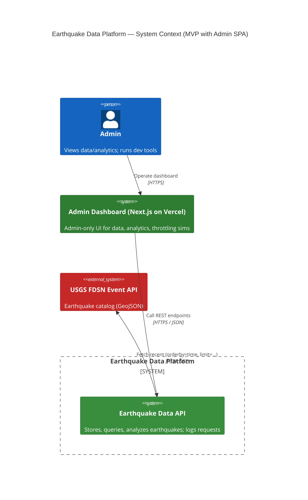
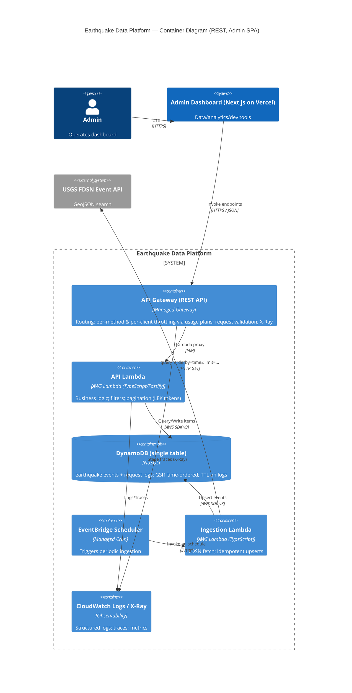
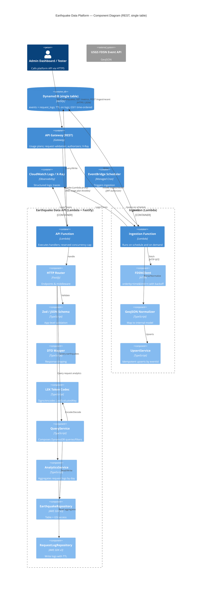

# Earthquake Monorepo

A Turborepo-powered monorepo for earthquake monitoring and visualization with Next.js, React 19, TypeScript 5, and Tailwind CSS 4.

## 📦 Structure

\`\`\`
earthquake-monorepo/
├── apps/
│   ├── infra/            # AWS CDK stacks targeting LocalStack
│   └── web/              # Next.js 15 earthquake monitoring app
├── packages/
│   ├── earthquakes/      # Domain logic, API clients, schemas
│   ├── libs/             # Shared libraries (errors, dynamo-client, observability)
│   ├── schemas/          # Shared schema definitions
│   ├── services/         # Lambda services (ingest-recent-service, earthquake-query-service)
│   ├── ui/               # Shared UI components (shadcn/ui based)
│   └── utils/            # Shared utility helpers and structured logging
├── specs/                # Feature specifications and runbooks
├── turbo.json            # Turborepo pipeline configuration
├── pnpm-workspace.yaml   # pnpm workspace configuration
└── package.json          # Root workspace manifest
\`\`\`

## 🚀 Quick Start

### Prerequisites

- Node.js 20+ 
- pnpm 10.18.2+

### Installation

\`\`\`bash
# Install dependencies
pnpm install

# Start development server (all apps)
pnpm dev

# Start dev server for specific app
cd apps/web && pnpm dev
\`\`\`

### Building

\`\`\`bash
# Build all apps and packages
pnpm build

# Build specific app
cd apps/web && pnpm build
\`\`\`

## 🌐 LocalStack Pro Setup

The infrastructure for this project uses LocalStack Pro to emulate AWS services locally. This enables:

- **Local development** without AWS account
- **Fast iteration** with instant deployments
- **Cost-effective** testing of serverless applications
- **Reproducible** infrastructure across team members

### Prerequisites

- Docker Desktop installed and running
- LocalStack Pro auth token ([get one here](https://app.localstack.cloud))
- Node.js 20 LTS and pnpm 10.18.2+

### Quick Start (15 minutes)

**Full instructions**: See [LocalStack CDK Quickstart](./specs/002-localstack-cdk-infra/quickstart.md)

\`\`\`bash
# 1. Set your LocalStack Pro token
export LOCALSTACK_AUTH_TOKEN="your-token-here"

# 2. Verify apps/infra/.env targets LocalStack (http://localhost:4566)
#    (repo ships with defaults; adjust if needed)

# 3. Start LocalStack
pnpm local:up

# 4. Bootstrap CDK environment (first time only)
pnpm infra:bootstrap

# 5. Deploy infrastructure
pnpm infra:deploy

# 6. Test the API (see quickstart.md for details)
\`\`\`

### Infrastructure Commands

\`\`\`bash
pnpm local:up           # Start LocalStack container
pnpm local:down         # Stop LocalStack container
pnpm infra:bootstrap    # Bootstrap CDK environment (once)
pnpm infra:deploy       # Deploy infrastructure stack
pnpm infra:diff         # Preview infrastructure changes
pnpm infra:destroy      # Destroy infrastructure stack
pnpm infra:synth        # Generate CloudFormation templates
\`\`\`

### What Gets Deployed

- **Lambda Functions** (Node.js 20.x): Earthquake ingestion and query services
- **DynamoDB Table**: Single table design for earthquake events and request logs
- **CloudWatch Logs**: Automatic logging for Lambda invocations
- **EventBridge Scheduler**: Periodic USGS data ingestion

### Infrastructure as Code

Infrastructure is defined in \`apps/infra/\` using:

- **AWS CDK v2**: Infrastructure as TypeScript code
- **cdklocal**: LocalStack-aware CDK wrapper
- **NodejsFunction**: Automatic TypeScript bundling for Lambda

See [specs/002-localstack-cdk-infra/quickstart.md](./specs/002-localstack-cdk-infra/quickstart.md) for detailed infrastructure documentation.

## � Documentation

- **[Logging & Error Handling](./docs/LOGGING_AND_ERROR_HANDLING.md)**: Structured logging patterns, AppError usage, and CloudWatch Insights queries

## �📝 Scripts

Available at the root level (runs across all packages via Turbo):

\`\`\`bash
pnpm dev         # Start development servers
pnpm build       # Build all apps and packages
pnpm lint        # Run Biome linter (with auto-fix)
pnpm format      # Format code with Biome
pnpm check       # Run Biome checks (CI mode, no fixes)
pnpm test        # Run all tests
pnpm test:watch  # Run tests in watch mode
pnpm test:ui     # Run tests with UI
pnpm coverage    # Generate test coverage reports
pnpm clean       # Remove build artifacts and node_modules
\`\`\`

## 📂 Workspace Packages

### Apps

- **\`@earthquake/web\`** (\`apps/web/\`)  
  Next.js 15 app router application for earthquake monitoring. Uses Turbopack for fast dev builds. Consumes shared packages from the monorepo.

### Packages

- **\`@earthquake/ui\`** (\`packages/ui/\`)  
  Shared React UI components built with shadcn/ui, Radix UI primitives, and Tailwind CSS. Components are consumed directly as source (transpiled by Next.js).

- **\`@earthquake/utils\`** (\`packages/utils/\`)  
  Shared utility functions (e.g., \`cn\` for className merging with clsx and tailwind-merge).

- **\`@earthquake/earthquakes\`** (\`packages/earthquakes/\`)  
  Domain-specific logic for earthquake data:
  - API clients (USGS feed integration)
  - Data schemas (Zod)
  - Normalization and filtering logic
  - React hooks for earthquake data management

## 🏗️ Turborepo Pipeline

Configured in \`turbo.json\`:

- **\`build\`**: Builds apps/packages. Outputs: \`.next/**\`, \`dist/**\`
- **\`dev\`**: Runs development servers (not cached, persistent)
- **\`lint\`**: Lints code with Biome
- **\`test\`**: Runs tests with Vitest. Outputs: \`coverage/**\`
- **\`format\`**: Formats code (not cached)

### Caching

Turborepo automatically caches build outputs locally. Remote caching is disabled by default but can be enabled:

\`\`\`bash
# Link to Vercel for remote caching (optional)
turbo login
turbo link
\`\`\`

## 🧪 Testing

Tests are run with Vitest. Currently located in \`apps/web/__tests__/\`.

\`\`\`bash
# Run all tests
pnpm test

# Run tests in watch mode
pnpm test:watch

# Run with coverage
pnpm coverage
\`\`\`

## �� Code Style

- **Linter/Formatter**: Biome (configured via \`biome.json\`)
- **TypeScript**: Strict mode enabled
- **Import Strategy**: 
  - \`@earthquake/*\` for workspace packages
  - \`@/*\` for app-local imports (apps/web only)

## 🔧 Development Notes

### Adding a New Package

1. Create directory under \`packages/\`
2. Add \`package.json\` with:
   \`\`\`json
   {
     "name": "@earthquake/your-package",
     "version": "0.0.0",
     "private": true,
     "exports": { ".": "./src/index.ts" }
   }
   \`\`\`
3. Run \`pnpm install\` from root to link
4. Import in apps: \`import { ... } from "@earthquake/your-package"\`

### Adding a New App

1. Create directory under \`apps/\`
2. Add \`package.json\` with workspace dependencies:
   \`\`\`json
   {
     "dependencies": {
       "@earthquake/ui": "workspace:*"
     }
   }
   \`\`\`
3. Configure in \`turbo.json\` if custom pipeline needed

### Transpiling Packages in Next.js

Shared packages are consumed as source (not pre-built) and transpiled by Next.js via the \`transpilePackages\` option in \`next.config.ts\`:

\`\`\`ts
transpilePackages: ["@earthquake/ui", "@earthquake/earthquakes"]
\`\`\`

This avoids the need to build packages during development.

## 📊 Quality Gates

| Gate | Command | Status |
|------|---------|--------|
| **Build** | \`pnpm build\` | ✅ PASS |
| **Lint** | \`pnpm lint\` | ✅ PASS |
| **Tests** | \`pnpm test\` | ✅ PASS |

## 🔮 Future Improvements

- [ ] **Remote Caching**: Set up Vercel or self-hosted remote caching for CI/CD speedup
- [ ] **Package Publishing**: Add build scripts (tsup/tsc) to compile packages to \`dist/\` for publishing
- [ ] **Storybook**: Add Storybook for UI component development and documentation
- [ ] **E2E Tests**: Add Playwright or Cypress for end-to-end testing
- [ ] **Changesets**: Implement changeset-based versioning and release workflow
- [ ] **Docker**: Add Dockerfile for production deployment (using \`turbo prune\`)
- [ ] **CI/CD**: Add GitHub Actions workflow for automated testing and deployment
- [ ] **Pre-commit Hooks**: Add Husky/lint-staged for automated linting before commits

## 📚 Resources

- [Turborepo Documentation](https://turbo.build/repo/docs)
- [pnpm Workspaces](https://pnpm.io/workspaces)
- [Next.js App Router](https://nextjs.org/docs/app)
- [Biome](https://biomejs.dev/)

## 🤝 Contributing

1. Install dependencies: \`pnpm install\`
2. Create a feature branch: \`git checkout -b feature/your-feature\`
3. Make changes and test: \`pnpm test && pnpm build\`
4. Run linter: \`pnpm lint\`
5. Commit and push changes
6. Open a pull request

## 📄 License

Private project. All rights reserved.
