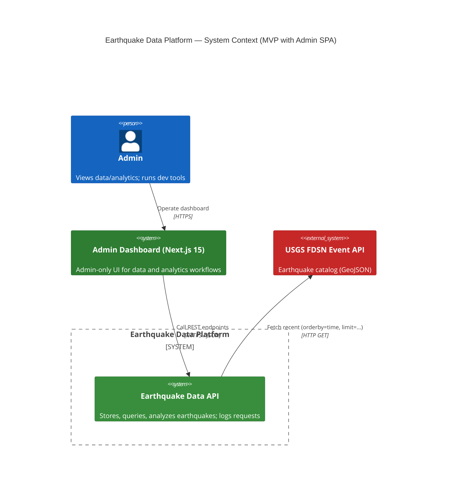
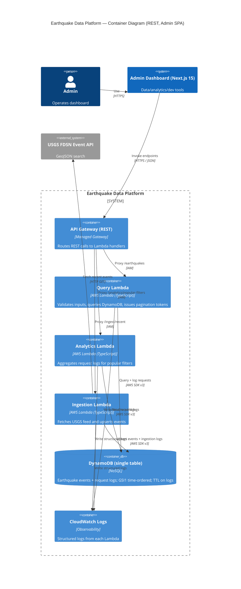

# Earthquake Data Platform

Turborepo monorepo with LocalStack-deployed AWS infrastructure (API Gateway, Lambda, DynamoDB) and Next.js admin dashboard.

**Stack:** TypeScript 5, Node.js 20, AWS CDK v2, Next.js 15, React 19, Tailwind CSS 4, Vitest, Biome.

## 🚀 Quick Start

### Automated Setup (Recommended for New Developers)

**Prerequisites:** Node.js 20+, pnpm 10.18.2+ (other checks done by script)

```bash
# Run interactive setup wizard
pnpm setup

# The script will:
# - Check all prerequisites (Node, pnpm, Docker, etc.)
# - Create and configure your .env file
# - Install all dependencies
# - Guide you through initial configuration
```

### Manual Setup

**Prerequisites:** Node.js 20+, pnpm 10.18.2+, Docker Desktop, [LocalStack Pro auth token](https://app.localstack.cloud)

```bash
# Install
pnpm install

# Configure environment (add LOCALSTACK_AUTH_TOKEN and NEXT_TOKEN_SECRET)
cp .env.example .env

# Deploy infrastructure to LocalStack
pnpm local:up
pnpm infra:bootstrap
pnpm infra:deploy

# Test endpoints
curl -X POST "$(jq -r '.IngestApi.ApiEndpoint' apps/infra/outputs.json)ingest/recent"
curl "$(jq -r '.IngestApi.ApiEndpoint' apps/infra/outputs.json)earthquakes"

# Start Next.js admin dashboard
pnpm --filter @earthquake/web dev

# Tear down
pnpm infra:destroy
pnpm local:down
```

## 📦 Structure

```
apps/
  infra/              # CDK stacks (API Gateway, Lambda, DynamoDB, CloudWatch)
  web/                # Next.js 15 admin dashboard
packages/
  earthquakes/        # Domain logic, USGS client, normalization
  env/                # Environment validation
  schemas/            # Zod schemas and shared types
  libs/
    dynamo-client/    # Single-table DynamoDB wrapper
    errors/           # Structured error types
    observability/    # CloudWatch logging
  services/
    analytics-service/          # Lambda: popular filter analytics
    earthquake-query-service/   # Lambda: query + pagination
    ingest-recent-service/      # Lambda: USGS ingestion
  ui/                 # shadcn/ui React components
  utils/              # Pure utility helpers
specs/                # Feature plans and runbooks
```

## 🛠️ Commands

```bash
pnpm dev              # Start all dev servers
pnpm build            # Build workspace
pnpm lint             # Biome linter (auto-fix)
pnpm test             # Vitest suite
pnpm test:watch       # Watch mode
pnpm coverage         # Coverage report
pnpm clean            # Remove build artifacts

# Infrastructure
pnpm local:up         # Start LocalStack
pnpm local:down       # Stop LocalStack
pnpm infra:bootstrap  # CDK bootstrap
pnpm infra:deploy     # Deploy stack
pnpm infra:destroy    # Tear down stack
pnpm infra:diff       # Preview changes
pnpm infra:synth      # Generate CloudFormation
```

## 📴 Offline Demo Mode

- Use the in-app admin tool at `http://localhost:3000/admin/backend` to switch between the bundled offline dataset and a live backend endpoint.
- Refresh or replace the offline dataset with `pnpm offline:sync` (requires `BACKEND_API_URL` or a CLI argument pointing to your API Gateway base URL).
- The offline payload that ships with the repo lives at [apps/web/src/data/offline-earthquakes.json](apps/web/src/data/offline-earthquakes.json) and powers both the Explorer and analytics views whenever no backend is configured.

## 📖 Documentation

- **[QUICKSTART.md](./QUICKSTART.md)** - One-page reference for new developers
- **[SETUP.md](./SETUP.md)** - Comprehensive setup guide with troubleshooting
- **[AGENTS.md](./AGENTS.md)** - Development guidelines and architecture principles
- **[specs/](./specs/)** - Feature specifications and runbooks

## 🏗️ Architecture

### Deployed Components (LocalStack)

- **API Gateway (REST)**: `/ingest/recent`, `/earthquakes`, `/analytics/popular-filters`
- **Lambda Functions** (Node.js 20.x): Ingestion, query, analytics handlers
- **DynamoDB**: Single-table design with GSI for time-ordered queries, TTL on logs
- **CloudWatch Logs**: Structured logs from all Lambdas

```mermaid
C4Component
title Earthquake Data Platform — Component Diagram (REST, single table)

Person(client, "Admin Dashboard / Tester", "Calls platform API via HTTPS")
System_Ext(usgs, "USGS FDSN Event API", "GeoJSON")
ContainerDb(dynamo, "DynamoDB (single table)", "NoSQL", "Earthquake events + request logs; TTL on logs; GSI1 time-ordered")
Container(apigw, "API Gateway (REST)", "Gateway", "Proxies REST calls to Lambda functions")
Container(obs, "CloudWatch Logs", "Observability", "Structured logs; ingestion summaries")

Container_Boundary(queryB, "Query Lambda") {
  Container(queryFn, "Query Handler", "Lambda", "Processes GET /earthquakes requests")
  Component(paramValidator, "Query Validator", "TypeScript + custom guards", "Validates and normalizes query params")
  Component(cursorCodec, "Cursor Codec", "TypeScript", "Encodes/decodes NextToken payloads")
  Component(queryService, "QueryService", "TypeScript", "Builds DynamoDB queries and aggregates results")
  Component(requestLogger, "RequestLogWriter", "AWS SDK v3", "Persists request metrics with TTL")
}

Container_Boundary(analyticsB, "Analytics Lambda") {
  Container(analyticsFn, "Analytics Handler", "Lambda", "Calculates popular filter combinations")
  Component(analyticsValidator, "Analytics Validator", "Zod", "Validates day/window query params")
  Component(analyticsService, "AnalyticsService", "TypeScript", "Aggregates request log partitions")
  Component(analyticsRepo, "AnalyticsRepository", "AWS SDK v3", "Reads request logs from DynamoDB")
}

Container_Boundary(ingB, "Ingestion Lambda") {
  Container(ingFn, "Ingestion Handler", "Lambda", "Processes POST /ingest/recent")
  Component(fdsn, "USGS Client", "TypeScript + Fetch", "Calls FDSN feed with retries")
  Component(normalizer, "GeoJSON Normalizer", "TypeScript", "Maps FDSN payload to internal event model")
  Component(upsert, "UpsertService", "TypeScript", "Performs idempotent writes using DynamoDB")
  Component(ingestRepo, "IngestionRepository", "AWS SDK v3", "Writes normalized earthquake events")
  Component(ingestLogWriter, "IngestionLogWriter", "AWS SDK v3", "Persists ingestion request metrics with TTL")
}

Rel(client, apigw, "GET /earthquakes, GET /analytics/popular-filters, POST /ingest/recent", "HTTPS / JSON")
Rel(apigw, queryFn, "Invoke (Lambda proxy)", "IAM")
Rel(apigw, analyticsFn, "Invoke (Lambda proxy)", "IAM")
Rel(apigw, ingFn, "Invoke (Lambda proxy)", "IAM")
Rel(queryFn, paramValidator, "Validate")
Rel(paramValidator, cursorCodec, "Derive pagination context")
Rel(paramValidator, queryService, "Pass validated filters")
Rel(queryService, requestLogger, "Write request metadata")
Rel(queryService, dynamo, "Query results")
Rel(requestLogger, dynamo, "Write request logs")
Rel(queryFn, obs, "Emit structured logs")
Rel(analyticsFn, analyticsValidator, "Validate analytics params")
Rel(analyticsValidator, analyticsService, "Pass validated window")
Rel(analyticsService, analyticsRepo, "Read request logs")
Rel(analyticsService, dynamo, "Aggregate from request log items")
Rel(analyticsFn, obs, "Emit structured logs")
Rel(ingFn, fdsn, "Fetch recent events", "HTTP GET")
Rel(ingFn, normalizer, "Normalize payload")
Rel(normalizer, upsert, "Build upsert input")
Rel(upsert, ingestRepo, "Write earthquake events")
Rel(ingFn, ingestLogWriter, "Record request summary")
Rel(ingestRepo, dynamo, "Write event items")
Rel(ingestLogWriter, dynamo, "Write request log items")
Rel(ingFn, obs, "Emit structured logs")
```






## 📂 Packages

### Apps

- **`@earthquake/web`** – Next.js 15 admin dashboard (Turbopack, React 19)
- **`@earthquake/infra`** – CDK stacks for LocalStack deployment

### Domain & Schemas

- **`@earthquake/earthquakes`** – USGS client, normalization, filtering logic
- **`@earthquake/schemas`** – Zod schemas and shared types
- **`@earthquake/env`** – Environment validation

### Services (Lambda)

- **`@earthquake/ingest-recent-service`** – Fetch and ingest USGS data
- **`@earthquake/earthquake-query-service`** – Query + pagination
- **`@earthquake/analytics-service`** – Popular filter analytics

### Libraries

- **`@earthquake/dynamo-client`** – Single-table DynamoDB wrapper
- **`@earthquake/errors`** – Structured error types
- **`@earthquake/observability`** – CloudWatch structured logging

### UI & Utilities

- **`@earthquake/ui`** – shadcn/ui React components
- **`@earthquake/utils`** – Pure utility helpers

## 📊 Quality Gates

| Command | Purpose |
|---------|---------|
| `pnpm build` | Compile all workspace targets |
| `pnpm lint` | Biome checks (required for merge) |
| `pnpm test` | Vitest suite + optional coverage |
